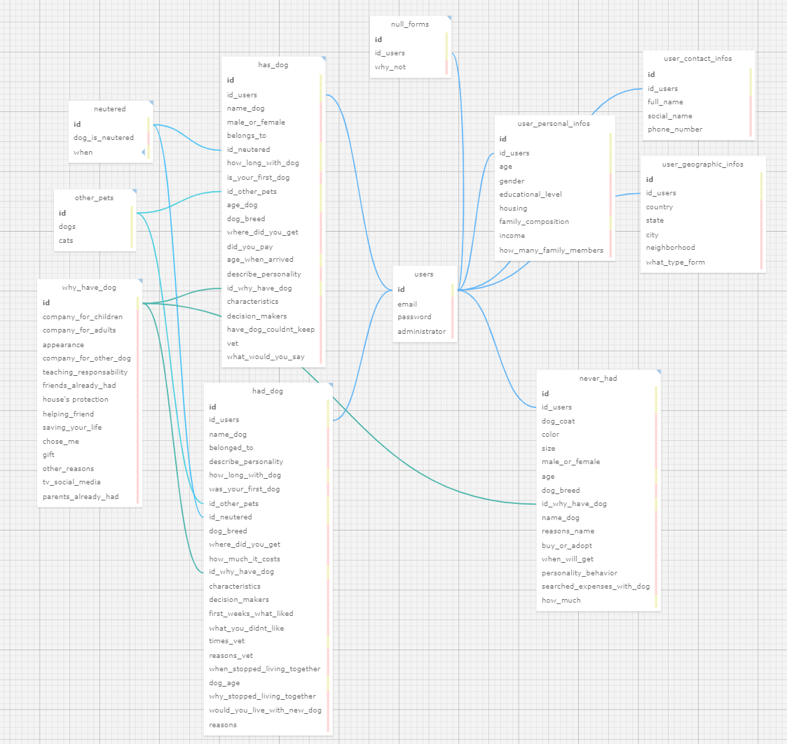

# READ.ME: Projeto de Modelagem de Banco de Dados Relacional

Projeto: Abandono Zero  
Aluna: Júlia Alves de Jesus

## Índice

- [Sobre o modelo relacional e objetivos](#sobre-o-modelo-relacional-e-objetivos)
- [Visualização do diagrama no SQL Designer](#visualização-do-diagrama-no-sql-designer)
- [Tabelas do modelo relacional](#tabelas-do-modelo-relacional)

## Sobre o modelo relacional e objetivos
 Este repositório tem como objetivo  apresentar o modelo relacional criado para a aplicação web do projeto Abandono Zero, do INSPA em parceria com a turma 14 do INTELI. O foco é estruturar os dados de forma organizada e relacionada, utilizando SQL. Para esta entrega de ponderada, foi utilizado a plataforma SQL Designer para criar os documentos .xml e .sql, assim como o diagrama que pode ser visualizado abaixo. 

## Visualização do diagrama no SQL Designer

## Tabelas do modelo relacional (entidades, seus atributos e relacionamentos)

### Tabela: users

| Campo | Tipo | Descrição |
|-------|------|-----------|
| id | integer | Identificador único do usuário (primary key). |
| email | varchar(100) | E-mail do usuário. |
| password | varchar | Senha do usuário. |
| administrator | booleano | Indica se o usuário é administrador (padrão: 'FALSE'). |

### Tabela: has_dog

| Campo | Tipo | Descrição |
|-------|------|-----------|
| id | integer | Identificador único do registro (primary key). |
| id_users | integer | Referência ao usuário na tabela users. |
| name_dog | varchar(50) | Nome do cão. |
| male_or_female | varchar(10) | Sexo do cão. |
| belongs_to | varchar(20) | Quem o cão pertence. |
| id_neutered | integer | Referência ao registro de esterilização na tabela neutered. |
| how_long_with_dog | integer | Tempo de convívio com o cão. |
- **is_your_first_dog** (booleano): Indica se é o primeiro cão.
- **id_other_pets** (integer): Referência aos outros animais de estimação na tabela other_pets.
- **age_dog** (integer): Idade do cão.
- **dog_breed** (varchar(100)): Raça do cão.
- **where_did_you_get** (varchar(50)): Onde obteve o cão.
- **did_you_pay** (booleano): Indica se pagou pelo cão.
- **age_when_arrived** (integer): Idade quando chegou.
- **describe_personality** (texto): Descrição da personalidade do cão.
- **id_why_have_dog** (integer): Referência ao motivo de ter um cão na tabela why_have_dog.
- **characteristics** (varchar(255)): Características do cão.
- **decision_makers** (varchar(100)): Responsáveis pela decisão.
- **have_dog_couldnt_keep** (texto): Teve um cachorro que não pode manter?
- **vet** (varchar(10)): Vezes que levou ao veterinário
- **what_would_you_say** (varchar(255)): O que diria sobre o cão.

### Tabela: neutered
- **id** (integer): Identificador único do registro (primary key).
- **dog_is_neutered** (booleano): Indica se o cão é castrado.
- **when** (integer): Quantos meses/anos tinha quando foi castrado.

### Tabela: other_pets
- **id** (integer): Identificador único do registro (primary key).
- **dogs** (integer): Número de cães.
- **cats** (integer): Número de gatos.

### Tabela: why_have_dog
- **id** (integer): Identificador único do registro (primary key).
- **company_for_children** (booleano): Cão é companhia para crianças.
- **company_for_adults** (booleano): Cão é companhia para adultos.
- **appearance** (booleano): Aparência do cão.
- **company_for_other_dog** (booleano): Cão é companhia para outro cão.
- **teaching_responsability** (booleano): Ensina responsabilidade.
- **friends_already_had** (booleano): Amigos já têm cães.
- **house_protection** (booleano): Proteção da casa.
- **helping_friend** (booleano): Ajuda a amigo.
- **saving_your_life** (booleano): Salvou sua vida.
- **chose_me** (booleano): Escolheu você.
- **gift** (booleano): Presente.
- **other_reasons** (varchar(255)): Outros motivos.
- **tv_social_media** (booleano): Influência da TV/mídia social.
- **parents_already_had** (booleano): Pais já tiveram cães.

### Tabela: had_dog
- **id** (integer): Identificador único do registro (primary key).
- **id_users** (integer): Referência ao usuário na tabela users.
- **name_dog** (varchar(50)): Nome do cão.
- **belonged_to** (varchar(20)): Pertencia a.
- **describe_personality** (texto): Descrição da personalidade.
- **how_long_with_dog** (integer): Tempo de convívio com o cão.
- **was_your_first_dog** (booleano): Foi o primeiro cão.
- **id_other_pets** (integer): Referência aos outros animais de estimação na tabela other_pets.
- **id_neutered** (integer): Referência ao registro de castração na tabela neutered.
- **dog_breed** (varchar(50)): Raça do cão.
- **where_did_you_get** (varchar(100)): Onde obteve o cão.
- **how_much_it_costs** (varchar(50)): Custo.
- **id_why_have_dog** (integer): Referência ao motivo de ter um cão na tabela why_have_dog.
- **characteristics** (varchar(255)): Características.
- **decision_makers** (varchar(50)): Responsáveis pela decisão.
- **first_weeks_what_liked** (texto): O que gostou nas primeiras semanas.
- **what_you_didnt_like** (texto): O que não gostou.
- **times_vet** (integer): Número de vezes no veterinário.
- **reasons_vet** (varchar(255)): Motivos para ir ao veterinário.
- **when_stopped_living_together** (varchar(100)): Quando pararam de conviver.
- **dog_age** (integer): Idade do cão.
- **why_stopped_living_together** (texto): Razões para parar de conviver.
- **would_you_live_with_new_dog** (booleano): Viveria com novo cão.
- **reasons** (texto): Razões.

### Tabela: user_personal_infos
- **id** (integer): Identificador único do registro (primary key).
- **id_users** (integer): Referência ao usuário na tabela users.
- **age** (integer): Idade.
- **gender** (varchar(20)): Gênero do usuário
- **educational_level** (varchar(100)): Nível de escolaridade do usuário.
housing (varchar(100)): Tipo de moradia.
### Tabela: user_geographic_infos
- **id** (integer): Identificador único do registro (primary key).
- **id_users** (integer): Referência ao usuário na tabela users.
- **country** (varchar(100)): País.
- **state** (varchar(100)): Estado.
- **city** (varchar(100)): Cidade.
- **neighborhood** (varchar(70)): Bairro.
- **what_type_form** (varchar(50)): O formulário que o usuário será direcionado (null, never_had, had_dog, has_dog)

### Tabela: user_contact_infos
- **id**  (integer): Identificador único do registro (primary key).
- **id_users**  (integer): Referência ao usuário na tabela users.
- **full_name** (varchar(255)): Nome completo.
- **social_name** (varchar(255)): Nome social.
- **phone_number** (varchar(20)): Número de telefone.

### Tabela: null_forms
- **id** (integer): Identificador único do registro (primary key).
- **id_users** (integer): Referência ao usuário na tabela users.
- **why_not** (texto): Razão pra não querer ter cachorro.

### Tabela: never_had
- **id** (integer): Identificador único do registro (primary key).
- **id_users** (integer): Referência ao usuário na tabela users.
- **dog_coat** (varchar(10)): Tipo de pelo.
- **color** (varchar(50)): Cor preferida.
- **size** (varchar(10)): Tamanho preferido.
- **male_or_female** (varchar(10)): Preferência por sexo.
- **age** (integer): Idade.
- **dog_breed** (varchar(50)): Raça preferida.
- **id_why_have_dog** (integer): Referência ao motivo de ter um cão na tabela why_have_dog.
- **name_dog** (varchar(50)): Nome imaginado.
- **reasons_name** (varchar(255)): Motivo para a escolha do nome.
- **buy_or_adopt** (varchar(10)): Preferência por comprar ou adotar.
- **when_will_get** (varchar(50)): Previsão de quando incluirá em casa.
- **personality_behavior** (texto): Personalidade/comportamento desejado.
- **searched_expenses_with_dog** (booleano): Se pesquisou sobre as despesas.
- **how_much** (decimal): Valor das despesas.

## Relacionamentos entre as Tabelas

| Tabela A     | Tabela B     | Relacionamento |
|--------------|--------------|----------------|
| users        | has_dog      | 1:n            |
| users        | had_dog      | 1:n            |
| users        | why_have_dog | n:n            |
| users        | user_personal_infos | 1:1    |
| users        | user_geographic_infos | 1:1   |
| users        | user_contact_infos | 1:1      |
| users        | null_forms   | 1:1            |
| users        | never_had    | 1:1            |
| has_dog      | neutered     | n:1            |
| has_dog      | other_pets   | n:1            |
| has_dog      | why_have_dog | n:1            |
| had_dog      | neutered     | n:1            |
| had_dog      | other_pets   | n:1            |
| had_dog      | why_have_dog | n:n           |
| never_had    | why_have_dog | 1:n           |
| other_pets   | todas      | não tem

## Regras do modelo, indicadas pelo parceiro INSPA e escolhas de tabelas no mesmo:

- Cada usuário deve ter um único registro na tabela *users*, identificado pelo seu e-mail.
- Os cães podem pertencer ao usuário registrado na tabela *users*
- Os registros de castração na tabela *neutered* indicam se o cão é castrado ou não, e em qual idade isso ocorreu *(escolha da aluna de separar essas informações na tabela, visando maior organização)*
- Os motivos para ter um cão na tabela *why_have_dog* devem ser detalhados, permitindo múltiplas opções *(por ser múltipla escolha, houve a indicação do professor para separar assim, visando a organização do banco de dados)*
- A tabela *had_dog* registra informações do passado, para respondentes que tiveram cães anteriormente, incluindo as razões para não manter o cão.
- Os dados pessoais do usuário na tabela *user_personal_infos* incluem idade, gênero, nível educacional, tipo de moradia e renda familiar.
- Já os dados geográficos do usuário na tabela *user_geographic_infos* incluem país, estado, cidade e bairro. (comentado pelo parceiro em Sprint Review que são informações importantes, preferência por estarem desacopladas de outras informações - sensíveis - do respondente)
- Os dados de contato do usuário na tabela *user_contact_infos* são utilizados para acompanhamento da relação e estudos futuros.
- Os registros na tabela *null_forms* são para usuários que nunca tiveram cães e nem querem ter um.
- A tabela *never_had* contém informações detalhadas sobre usuários que nunca tiveram cães, incluindo preferências e características imaginadas para um futuro cão.

